# v4-opa
repo for youtube video 4, using OPA for resource protection.

# Protected Resource Change Workflow

This repository demonstrates a workflow for protecting critical Azure infrastructure resources using OPA (Open Policy Agent) policies and GitHub Actions.

## Overview

This workflow provides an additional layer of protection for critical Azure resources by:
1. Detecting changes to protected resources in Pull Requests
2. Requiring additional approval via GitHub PR reviews
3. Notifying stakeholders through Slack
4. Automating the deployment after approval

## Workflow Diagram

```mermaid
flowchart TD
    A[Pull Request Created 📝] --> B[GitHub Action Triggered ⚡]
    B --> C[Terraform Plan 🔍]
    C --> D[OPA Policy Check ⚖️]
    D --> E{Protected Resources? 🛡️}
    E -->|No| F[PR Ready for Review ✅]
    E -->|Yes| G[Send Slack Notification 💬]
    G --> H[Link to PR for Review 🔗]
    H --> I{PR Approved? 🤔}
    I -->|No| J[PR Denied/Closed ❌]
    I -->|Yes| K[Merge to Main 🎯]
    K --> L[GitHub Action Triggered ⚡]
    L --> M[Terraform Plan 🔍]
    M --> N[Terraform Apply 🚀]
    N --> O[Infrastructure Updated 🏗️]

    style E decision
    style I decision
    style G fill:#e75480,stroke:#333,color:#fff
    style N fill:#0066cc,stroke:#333,color:#fff
```



## Components

### 1. OPA Policy (`policy/terraform.rego`)
The policy defines what constitutes a protected resource through tags and resource types:

```rego
# Protected resources are identified by tags
protected_tags := {
    "environment": "production",
    "critical": "true"
}

# Critical resource types that need extra scrutiny
critical_resource_types := {
    "azurerm_resource_group",
    "azurerm_virtual_network",
    "azurerm_subnet"
}
```

Key functions:
- `has_protected_tags`: Checks if a resource has the protected tag combination
- `is_critical_type`: Verifies if the resource is a critical type
- `requires_approval`: Identifies changes requiring additional approval
- `destroy_details`: Formats resource details for notifications
- `deny`: Creates warning messages for protected changes

### 2. GitHub Actions Workflow (`.github/workflows/opa-protect-destroy.yml`)
The main workflow handles both PR checks and deployment:

PR Flow:
```yaml
steps:
  - Terraform Plan
  - OPA Policy Check
  - Slack Notification with PR link
  - Wait for PR Approval
```

Main Branch Flow:
```yaml
steps:
  - Terraform Plan
  - Direct Apply (already approved via PR)
```

### 3. Infrastructure Code (`main.tf`)
Example infrastructure showing how to mark resources as protected:

```hcl
resource "azurerm_virtual_network" "vnet" {
    name                = "vnet-talkitdoit-terraform"
    location            = azurerm_resource_group.rg.location
    resource_group_name = azurerm_resource_group.rg.name
    address_space       = ["172.16.0.0/16"]

    # Protected resource tags
    tags = {
        environment = "production"
        critical    = "true"
    }
}
```

## Tool Installation

Before getting started, you'll need to install several tools. Below are the installation instructions for different operating systems.

### Terraform Installation

#### macOS
```bash
# Using Homebrew
brew tap hashicorp/tap
brew install hashicorp/tap/terraform

# Verify installation
terraform version
```

#### Windows
```powershell
# Using Chocolatey
choco install terraform

# Or download the ZIP file from: https://developer.hashicorp.com/terraform/downloads
# Extract to a directory and add to PATH

# Verify installation
terraform version
```

#### Linux (Ubuntu/Debian)
```bash
# Add HashiCorp GPG key
wget -O- https://apt.releases.hashicorp.com/gpg | sudo gpg --dearmor -o /usr/share/keyrings/hashicorp-archive-keyring.gpg

# Add HashiCorp repository
echo "deb [signed-by=/usr/share/keyrings/hashicorp-archive-keyring.gpg] https://apt.releases.hashicorp.com $(lsb_release -cs) main" | sudo tee /etc/apt/sources.list.d/hashicorp.list

# Update and install
sudo apt update && sudo apt install terraform

# Verify installation
terraform version
```

### Open Policy Agent (OPA) Installation

#### macOS
```bash
# Using Homebrew
brew install opa

# Verify installation
opa version
```

#### Windows
```powershell
# Download the latest release from: https://github.com/open-policy-agent/opa/releases
# Add the executable to your PATH

# Verify installation
opa version
```

#### Linux (Ubuntu/Debian)
```bash
# Download the binary
curl -L -o opa https://openpolicyagent.org/downloads/latest/opa_linux_amd64

# Make it executable
chmod 755 opa

# Move to PATH
sudo mv opa /usr/local/bin

# Verify installation
opa version
```

### Slack Installation and Configuration

#### Desktop Application
Slack can be installed from their official website for all platforms:
- macOS: Download from the Mac App Store or https://slack.com/downloads/mac
- Windows: Download from the Microsoft Store or https://slack.com/downloads/windows
- Linux: Download from https://slack.com/downloads/linux

#### Creating a Slack App and Webhook URL

1. **Create a Slack App**:
   ```
   1. Visit https://api.slack.com/apps
   2. Click "Create New App"
   3. Choose "From scratch"
   4. Enter your app name and select your workspace
   5. Click "Create App"
   ```

2. **Enable Incoming Webhooks**:
   ```
   1. In your app settings, click on "Incoming Webhooks"
   2. Toggle "Activate Incoming Webhooks" to On
   3. Click "Add New Webhook to Workspace"
   4. Select the channel where notifications should be posted
   5. Click "Allow" to authorize the webhook
   ```

3. **Get the Webhook URL**:
   ```
   1. After authorization, you'll see your webhook URL under "Webhook URLs for Your Workspace"
   2. Copy this URL - this is what you'll use in the GitHub secrets as SLACK_WEBHOOK_URL
   ```

4. **Test the Webhook** (optional):
   ```bash
   # Using curl to test the webhook
   curl -X POST -H 'Content-type: application/json' \
   --data '{"text":"Hello, World!"}' \
   YOUR_WEBHOOK_URL

5. **Store Webhook in GitHub Actions Secrets**:
   See the "GitHub Actions Secrets Setup" section below for instructions on storing your webhook URL securely.

### GitHub Actions Secrets Setup

To securely store sensitive information like the Slack webhook URL and Azure credentials, you'll need to set up GitHub Actions secrets:

1. **Access Repository Secrets**:
   ```
   1. Go to your GitHub repository
   2. Click on "Settings" tab
   3. Select "Secrets and variables" from the left sidebar
   4. Click on "Actions" under secrets and variables
   5. Click "New repository secret"
   ```

2. **Add Required Secrets**:
   - For Slack Webhook:
     ```
     1. Name: SLACK_WEBHOOK_URL
     2. Value: Your webhook URL from the Slack app setup
     3. Click "Add secret"
     ```
   - For Azure Credentials:
     ```
     1. Name: AZURE_CREDENTIALS
     2. Value: Service principal JSON
     3. Click "Add secret"
     ```
     ```
     1. Name: AZURE_SUBSCRIPTION_ID
     2. Value: Your Azure subscription ID
     3. Click "Add secret"
     ```

3. **Verify Secrets**:
   - Secrets should appear in your list with masked values
   - You cannot view secret values after creation
   - To update a secret, you'll need to create a new value

4. **Using Secrets in Workflows**:
   Secrets are accessed in your GitHub Actions workflows using this syntax:
   ```yaml
   steps:
     - name: Send Slack Notification
       env:
        SLACK_WEBHOOK: ${{ secrets.SLACK_WEBHOOK_URL }}
   ```

### GPG Keys Installation

#### macOS
```bash
# Using Homebrew
brew install gnupg

# Verify installation
gpg --version
```

#### Windows
```powershell
# Download and install Gpg4win from: https://www.gpg4win.org/

# Verify installation
gpg --version
```

#### Linux (Ubuntu/Debian)
```bash
# Install GPG
sudo apt update && sudo apt install gnupg

# Verify installation
gpg --version
```

## Setup Requirements

1. **Azure Requirements**:
   - Azure Subscription
   - Service Principal with Contributor access
   - Storage Account for Terraform state

2. **GitHub Secrets Required**:
   ```
   AZURE_CREDENTIALS          # Service Principal credentials
   AZURE_SUBSCRIPTION_ID      # Azure Subscription ID
   SLACK_WEBHOOK_URL         # Slack Webhook for notifications
   ```

3. **Slack Integration**:
   - Webhook URL for sending notifications
   - Channel where notifications should be sent

## How It Works

1. **Making Changes**:
   - Create a branch and PR with infrastructure changes
   - Workflow automatically detects if changes affect protected resources

2. **Protection Process**:
   - OPA evaluates changes against protection policies
   - Sends Slack notification with link to PR
   - Requires approval through GitHub PR review process

3. **Deployment**:
   - After PR approval and merge to main
   - Changes are automatically applied to Azure

## Example Scenario

Changing a protected VNet's address space:

```hcl
# Original configuration
resource "azurerm_virtual_network" "vnet" {
    address_space = ["10.0.0.0/16"]
    # ...
}

# Changed configuration
resource "azurerm_virtual_network" "vnet" {
    address_space = ["172.16.0.0/16"]
    # ...
}
```

This change will:
1. Trigger OPA detection (protected by tags)
2. Send Slack notification with PR link
3. Require PR approval
4. Automatically apply after merge to main

## Contributing

1. Fork the repository
2. Create a feature branch
3. Submit a Pull Request

## License

MIT License

## Author

TalkITDoIT

## Acknowledgments

- Open Policy Agent (OPA) team
- HashiCorp Terraform
- GitHub Actions

